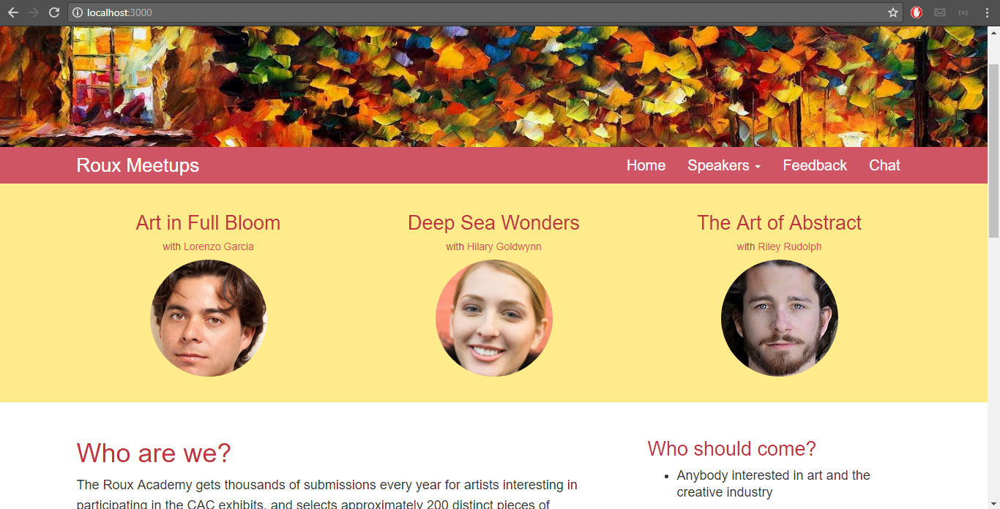

# Artist Website

An interactive website that allows painters to coordinate events.  Information about possible speakers is shown and meetup info can be posted on the feedback section.  A live chat room is also available for real-time communication. 

***

\[**Technologies**\]
* Nodejs
* Express
* Socket io
* Bootstrap

***

\[**How to run**\]
1. clone/download repo. 
2. go to folder path and do npm install 
2. do node app/app.js
3. open web browser and go to localhost:3000
